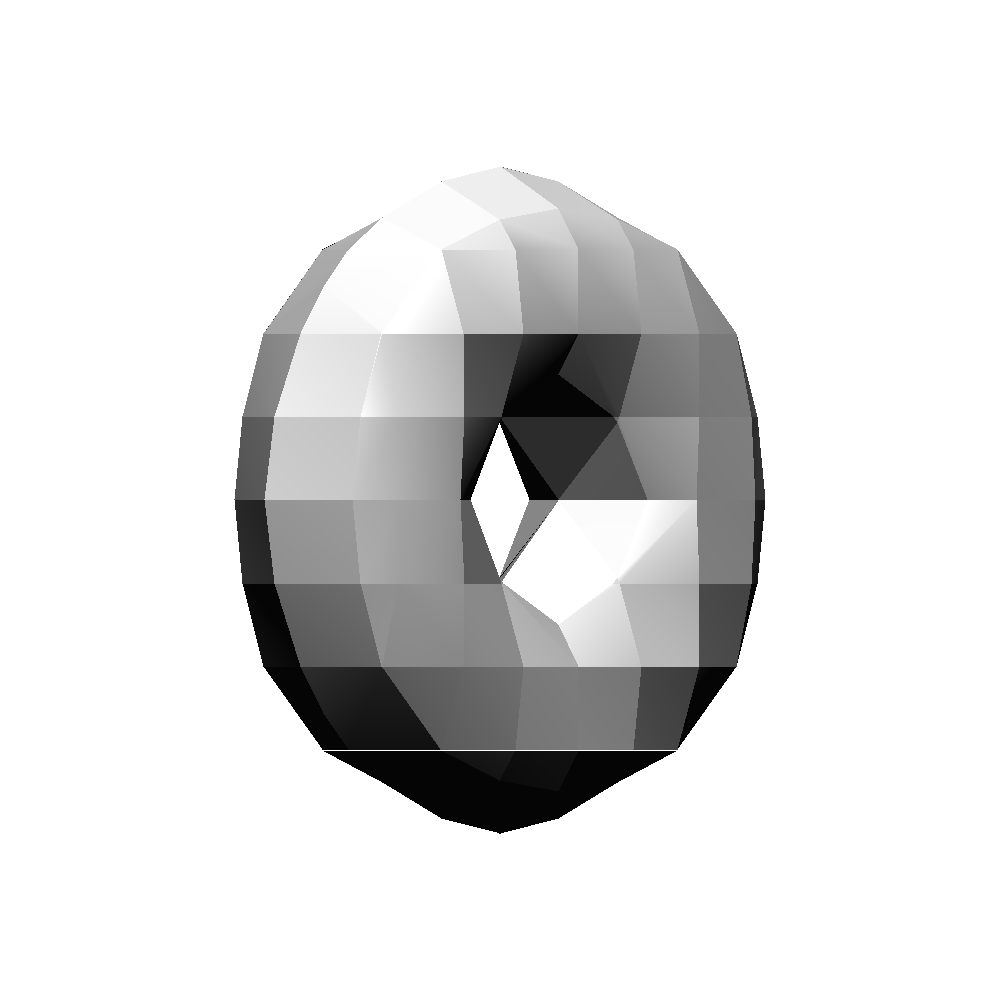
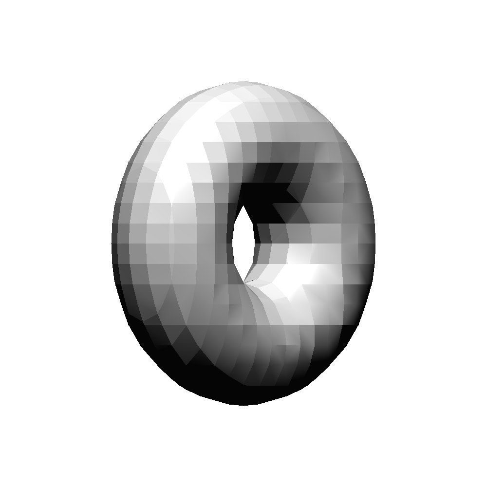
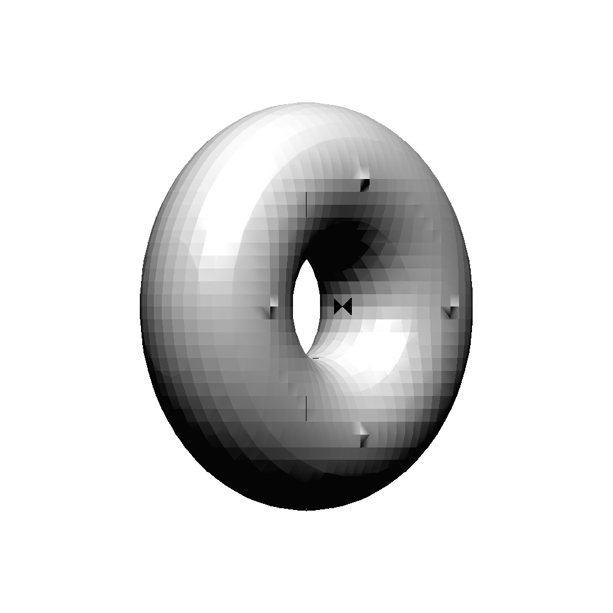

# Marching Cubes Algorithm
Use [Marching Cubes](https://en.wikipedia.org/wiki/Marching_cubes) to generate triangle mesh from implicit functions.
   
**Implicit functions** (in the 3-variable case): functions written in form f(x, y, z) = V. V is usually called the isosurface value.

|Marching cubes size|0.2|0.1|0.05|
|--|--|--|--|
|Rendered mesh||||

The mesh is rendered by the [renderer I wrote](https://github.com/bchao1/go-render).

## Usage
See `main.py`. Modify parameters as you wish. There are some implicit functions already defined in `src/functions.py`.

## References
- [Marching Cubes Algorithm](http://paulbourke.net/geometry/polygonise/)
- [Plotting 3D implicit fields with Python](https://stackoverflow.com/questions/29054828/is-it-possible-to-plot-implicit-3d-equation-using-sympy)
- [Catmull-Clark Subdivision](https://en.wikipedia.org/wiki/Catmull–Clark_subdivision_surface) is an algorithm to smooth the surfaces of a polygon mesh